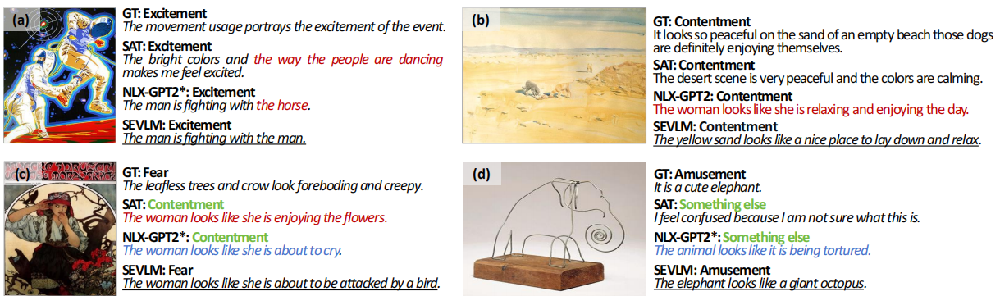
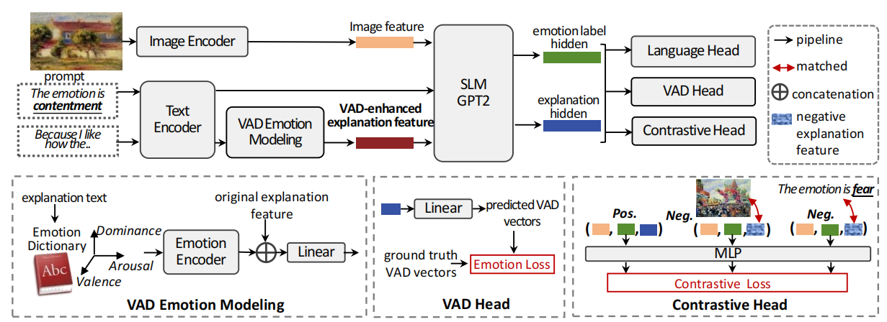

<div align="center">

# Training A Small Emotional Vision Language Model for Visual Art Comprehension

<h4 align="center">
  Jing Zhang  &nbsp; 
  Liang Zheng <sup>&dagger;</sup> &nbsp;
  Meng Wang </sup> &nbsp;
  Dan Guo <sup>&dagger;
</h4>

This is the repo for the official implementation of the SEVLM.
<br> 
<div>
    <a href="https://arxiv.org/abs/2403.11150"></a>
    <a href="https://huggingface.co/jing5566/SEVLM"></a>
</div>


</div>

## 💡Abstract
This paper develops small vision language models to understand visual art, which, given an art work, aims to identify its emotion category and explain this prediction with natural language. While small models are computationally efficient, their capacity is much limited compared with large models. To break this trade-off, this paper builds a small emotional vision language model (SEVLM) by emotion modeling and input-output feature alignment. On the one hand, based on valence-arousal-dominance (VAD) knowledge annotated by psychology experts, we introduce and fuse emotional features derived through VAD dictionary and a VAD head to align VAD vectors of predicted emotion explanation and the ground truth. This allows the vision language model to better understand and generate emotional texts, compared with using traditional text embeddings alone. On the other hand, we design a contrastive head to pull close embeddings of the image, its emotion class, and explanation, which aligns model outputs and inputs. On two public affective explanation datasets, we show that the proposed techniques consistently improve the visual art understanding performance of baseline SEVLMs. Importantly, the proposed model can be trained and evaluated on a single RTX 2080 Ti while exhibiting very strong performance: it not only outperforms the state-of-the-art small models but is also competitive compared with LLaVA 7B after fine-tuning and GPT4(V).

Fig. 1: Examples comparing different methods of predicting emotion class and explaining why this emotion is evoked given an art image on both ArtEmis v1.0 test set and ArtEmis v2.0 Combined test set. In both examples, the explanations from existing methods are misaligned with the emotion label or the art image, but our method gives superior results. Green fonts indicate incorrect emotion classification results; red texts indicate large discrepancies between the semantics of explanations and visual content; blue texts denote that the emotion of the explanations does not correspond to the predicted category.

## 🚀Model Architecture

Fig.2: Detailed network structure of the proposed small emotional vision language model. It has: 1) a vision language backbone including an image encoder, a samll language model (SLM) GPT2 decoder, and a language head; 2) VAD emotion modeling introducing emotion knowledge VAD into text embeddings to enhance model capacity of understanding emotion; 3) a VAD head  to learn VAD-aware emotion; and 4) a contrastive head to force the features alignment among image, emotion label and explanation. During training, we use the emotion label and explanation as ground truth. In inference, we use the prompt `The emotion is \_' and an art image as input and generate the emotion label and explanations. 

## 🔥News
- **[2024.07.02]** SEVLM is accepted by ECCV 2024!
- **[2024.03.17]** We have released the codes of SEVLM!


## ⚙️Preparations
### Requirements
- [PyTorch](https://pytorch.org/) 1.8 or higher
- `pip install git+https://github.com/openai/CLIP.git`
-  `pip install transformers`
-  `pip install git+https://github.com/huggingface/accelerate`

### Images Download
We conduct experiments on artEmis Dataset [WikiArt dataset](https://github.com/cs-chan/ArtGAN/tree/master/WikiArt%20Dataset), and then resize images into a 600px resized folder, named `wikiart_rescaled_max_size_to_600px_same_aspect_ratio` 

### Data preprocessing
We conduct experiments on two benchmark datasets: [ArtEmis v1.0 ](https://arxiv.org/abs/2101.07396)  and [ArtEmis v2.0](https://arxiv.org/abs/2204.07660). You need to perform [data preprocessing](preprocess_data.md)  for both datasets. 


## 🎇Run
Please run from the command line with: <br>
```bash
accelerate launch artEmisX_train.py --ckpt_path /xxxx/ckpts/  --caption_save_path /xxxx/results/  --nle_data_train_path /xxxx/data/artEmis/artEmisX_cl_train.json  --nle_data_val_path /xxxx/data/artEmis/artEmisX_val.json
```

## ☕Citation
If you find this work useful in your research, please consider citing:
```
@misc{zhang2024training,
      title={Training A Small Emotional Vision Language Model for Visual Art Comprehension}, 
      author={Jing Zhang and Liang Zheng and Meng Wang and Dan Guo},
      year={2024},
      eprint={2403.11150},
      archivePrefix={arXiv},
      primaryClass={cs.CV}
}
```

## 🍃Acknowledgement

- We thank [NLX-GPT](https://github.com/fawazsammani/nlxgpt) for  open-source implementation of their language model. SEVLM repo is built on [NLX-GPT](https://github.com/fawazsammani/nlxgpt).
